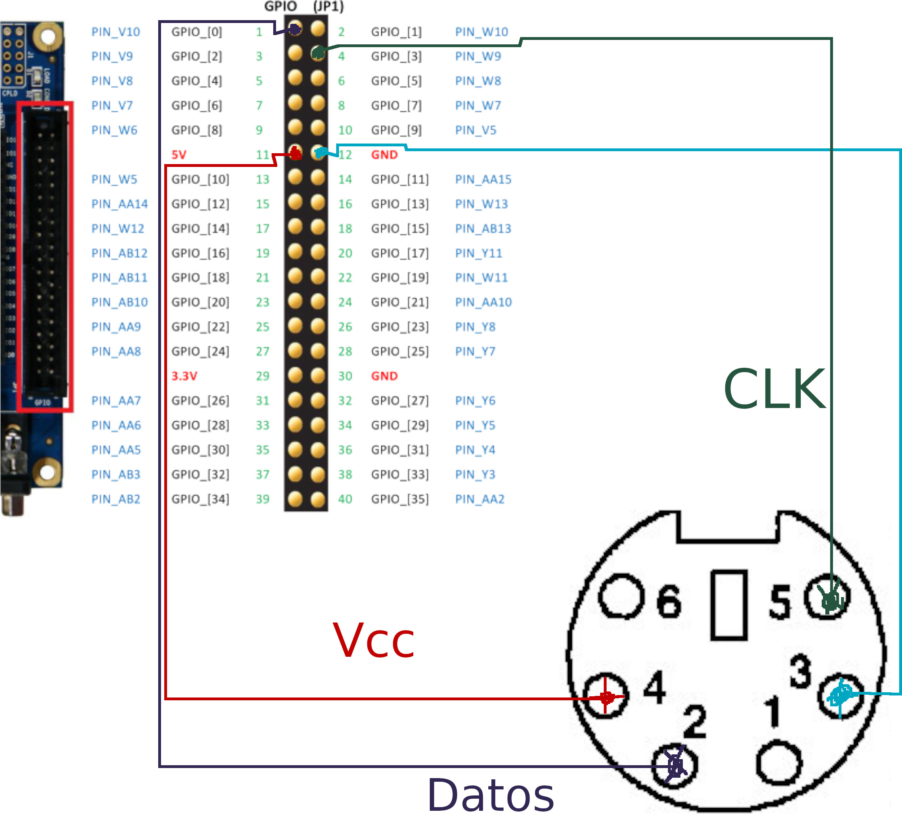

# ascii_fga_ps2_keyboard

| PIN | Funcion                     | Dirección          | Descripción    |
| 1   | Datos                       | :left_right_arrow: | Llave de datos |
| 2   | N/C o Datos para ps/2 Dual  | -                  | No se conecta  |
| 3   | GND                         | :arrow_down_small: | GND            |
| 4   | Vcc 5V+                     | :arrow_right:      | Vcc            |
| 5   | Reloj                       | :arrow_left:       | Reloj          |
| 6   | N/C o Reloj2 para ps/2 dual | -                  | No se conecta  |

